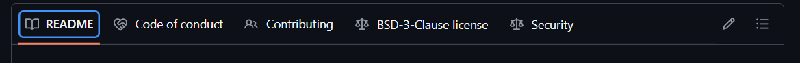

# AIoD Metadata Catalogue

<p align="center">
  
  
  
  
  
  
</p>

Welcome to the **AI on Demand (AIoD) Metadata Catalogue**! This repository hosts the REST API for the metadata catalogue, which serves as a central hub for indexing, managing, and searching metadata related to artificial intelligence resources (datasets, models, tools, and more).

<p align="center">
  
</p>

This project acts as the backend layer that enables rich cataloging features, relying on **MySQL** for relational data persistence, **Elasticsearch** for high-performance full-text search and filtering, and **Keycloak** for robust authentication and authorization.

---

## 📑 Table of Contents

- [Features](#-features)
- [Architecture Overview](#-architecture-overview)
- [Prerequisites](#-prerequisites)
- [Installation & Setup](#-installation--setup)
  - [1. Clone the Repository](#1-clone-the-repository)
  - [2. Configuration](#2-configuration)
  - [3. Running the Application via Docker (Recommended)](#3-running-the-application-via-docker-recommended)
  - [4. Local Development (Without Docker)](#4-local-development-without-docker)
- [Using the API](#-using-the-api)
- [Development and Testing](#-development-and-testing)
- [Monitoring](#-monitoring)
- [Contributing](#-contributing)
- [License](#-license)

---

## ✨ Features

- **FastAPI-powered REST API**: High-performance asynchronous API for managing and querying metadata.
- **Advanced Search Capabilities**: Integrated with Elasticsearch for complex querying across vast metadata sets.
- **Secure Authentication**: Built-in Keycloak integration ensures role-based access control (RBAC).
- **Data Connectors**: Ships with profiles and connectors to external platforms like HuggingFace Datasets, OpenML, Zenodo, and AIBuilder.
- **Containerized Ecosystem**: fully automated deployment setup using Docker Compose, including a pre-configured ELK/Elasticsearch stack and MySQL database.
- **Monitoring Ready**: Includes Prometheus metrics and Grafana dashboards for health and performance monitoring.

---

## 🏗 Architecture Overview

The application is composed of several interdependent services orchestrated through Docker Compose:

1. **App (apiserver)**: The main FastAPI web service running the Python REST backend.
2. **Database (sqlserver)**: MySQL 8.3 container to persist transactional metadata.
3. **Search (elasticsearch)**: Elasticsearch 8.8 container used as the primary search engine for the catalog.
4. **Auth (keycloak)**: Keycloak 24.0.4 for OAuth2 / OpenID Connect user authentication.
5. **Connectors**: Various worker containers (HuggingFace, OpenML, Zenodo) to ingest and sync external datasets into the catalogue.
6. **Monitoring (optional)**: Prometheus and Grafana for metrics visualization.
7. **Nginx (optional)**: Reverse proxy for managing external routing.

---

## ⚙️ Prerequisites

To run this application, ensure you have the following installed on your local machine:

- **Docker**: For running containerized services.
- **Docker Compose** (or Docker Desktop which includes Compose).
- **Bash**: To execute the setup scripts.
- *(Optional)* **Python 3.11+**: If you intend to run the FastAPI service locally without Docker.

---

## 🚀 Installation & Setup

We recommend running the catalogue using the provided Docker setup, as it abstracts away the complex multi-service dependencies (Database, Search, Auth).

### 1. Clone the Repository

```bash
git clone https://github.com/aiondemand/AIOD-rest-api.git
cd AIOD-rest-api
```

### 2. Configuration

Environment variables configure ports, credentials, and settings.

1. Review the `.env` file at the root of the project.
2. If you need to customize settings for your local development, create a file named `override.env`. The launch scripts will automatically source it.
3. *Optional*: If you want your local code changes to be live-reloaded inside the container, set `USE_LOCAL_DEV=true` in your `.env` or `override.env`. This will mount your `src/` directory to the container automatically.

### 3. Running the Application via Docker (Recommended)

To build and start all core services, use the included Bash script:

```bash
./scripts/up.sh
```

**What happens here?**
The script will load your environment variables and launch the `docker compose` command in detached mode. It starts the backend API, MySQL, Elasticsearch, and Keycloak.

To stop the application, use:

```bash
./scripts/down.sh
```

**Accessing the Application:**
Once the containers are up and healthy, you can access the API and its documentation:

- **Swagger UI (Interactive API Docs):** [http://localhost:8000/docs](http://localhost:8000/docs)
- **ReDoc:** [http://localhost:8000/redoc](http://localhost:8000/redoc)
- **Keycloak Console:** [http://localhost:8080](http://localhost:8080) (Default credentials are in the `.env` file)

### 4. Local Development (Without Docker)

If you prefer to run the FastAPI server natively on your machine while keeping the dependencies (MySQL, Elasticsearch) in Docker:

1. Start only the background services:
   ```bash
   docker compose up -d sqlserver elasticsearch keycloak
   ```
2. Create and activate a virtual environment:
   ```bash
   python3 -m venv .venv
   source .venv/bin/activate
   ```
3. Install dependencies:
   ```bash
   pip install -e .[dev]
   ```
4. Run the Uvicorn server:
   ```bash
   cd src
   uvicorn main:app --reload --port 8000
   ```

---

## 📖 Using the API

The easiest way to interact with the API locally is through the **Swagger UI** (`http://localhost:8000/docs`).

<p align="center">
  <em>(Replace this placeholder with a screenshot of the Swagger UI)</em><br>
  
</p>

1. **Authentication**: Before making requests that require authorization, you must obtain a token via Keycloak. In the Swagger UI, click the **Authorize** button and log in.
2. **Endpoints**: The catalogue uses versioned APIs (e.g., `/v1/...`). You will find endpoints to manage `datasets`, `models`, `publications`, `experiments`, and `nodes`.

---

## 🛠 Development and Testing

The project uses `pytest` for testing and `ruff` / `pre-commit` for code quality checks.

**Running Tests:**

Ensure your virtual environment is active and dependencies are installed. To run the test suite:

```bash
pytest src/tests/
```

**Pre-commit Hooks:**

We enforce code style and formatting using pre-commit. To install the hooks:

```bash
pre-commit install
```

---

## 📊 Monitoring

The repository provides profiles to spin up **Prometheus** and **Grafana** alongside the API.
To launch the stack with monitoring enabled, pass the `monitoring` profile to the launch script:

```bash
./scripts/up.sh monitoring
```

- **Grafana Dashboard**: Accessible at [http://localhost:3000](http://localhost:3000) (Configured via `AIOD_GRAFANA_PORT`).

---

## 🤝 Contributing

We welcome contributions! Please follow the standard pull request workflow:
1. Fork the repository.
2. Create a feature branch (`git checkout -b feature/my-new-feature`).
3. Commit your changes (`git commit -m 'Add some feature'`).
4. Push to the branch (`git push origin feature/my-new-feature`).
5. Open a Pull Request.

---

## 📄 License

This project is licensed under the [MIT License](LICENSE) - Copyright (c) 2023 AI On Demand.
